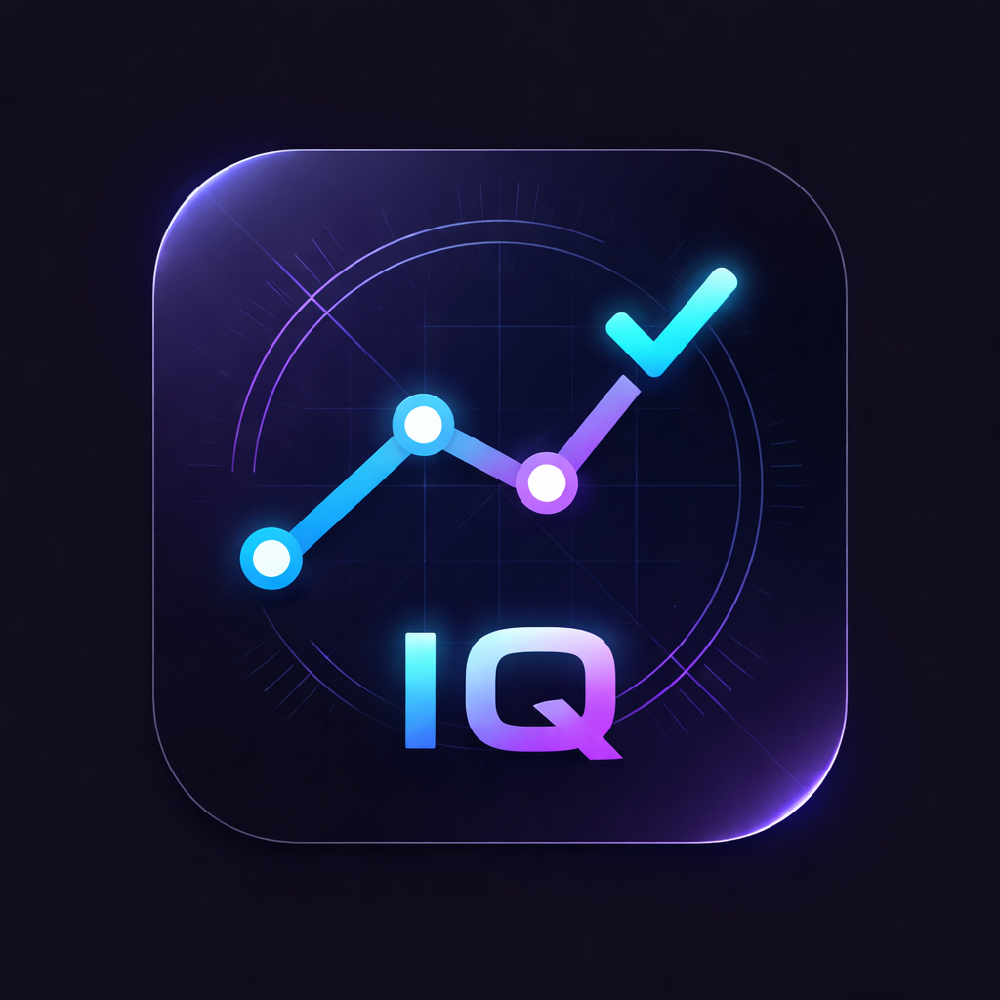

# Timeline IQ - Project Time Estimator



**Timeline IQ** is a modern, feature-rich WPF desktop application for tracking and analyzing project time estimates. Built with .NET 8, it helps you improve your estimation accuracy over time through detailed analytics and bias detection.

---

## ✨ Features

### 📊 **Advanced Analytics Dashboard**
- **Accuracy Score**: Track your overall estimation accuracy (0-100)
- **Average Deviation**: Monitor percentage deviation from estimates
- **Under/Over Estimation Tracking**: See how often you under or overestimate
- **Total Projects Counter**: Keep track of all your projects

### 🎯 **Estimation Bias Analysis**
- Analyzes estimation patterns across three project sizes:
  - **Small Projects** (0-10 hours)
  - **Medium Projects** (10-50 hours)
  - **Large Projects** (50+ hours)
- Identifies which project sizes you tend to misjudge
- Provides actionable insights to improve future estimates

### 🤖 **Smart Prediction System**
- Real-time estimation suggestions based on historical data
- Learns from your past projects
- Adjusts recommendations based on global average deviation

### 📈 **Performance Visualization**
- Mini chart showing last 5 completed projects
- Visual comparison of Estimated vs. Actual hours
- Color-coded indicators (Green: Under budget, Red: Over budget)

### 🔍 **Filtering & Sorting**
- Filter projects by status: All, Planned, Active, Completed
- Sortable DataGrid columns
- Quick project lookup

### 📤 **Export & Reporting**
- **CSV Export**: Export all project data to CSV format
- **Monthly Reports**: Generate detailed monthly performance reports
  - Performance metrics
  - Bias analysis breakdown
  - Complete project listings

### ⚙️ **Status Automation**
- Automatically updates status to "Active" when actual hours > 0
- Automatically marks as "Completed" when end date is set
- Prevents saving projects with zero estimated hours

---

## 🎨 Modern Dark Theme UI

- **Custom Title Bar**: Minimalist window controls (Minimize, Maximize, Close)
- **Card-Based Dashboard**: Clean, organized metric display
- **Professional Color Scheme**:
  - Background: `#1E1E1E`
  - Cards: `#2D2D30`
  - Accent: `#4FC3F7` (Cyan) & `#7C4DFF` (Purple)
- **Smooth Interactions**: Hover effects and visual feedback
- **Responsive Layout**: Adapts to different window sizes

---

## 🛠️ Technology Stack

- **Framework**: .NET 8 (WPF)
- **Architecture**: MVVM (Model-View-ViewModel)
- **Database**: SQLite (via Microsoft.Data.Sqlite)
- **UI**: Pure WPF (No external UI libraries)
- **Language**: C# 12

---

## 📦 Installation

### Option 1: Download Pre-built Release
1. Download the latest release from [Releases](../../releases)
2. Extract `ProjectTimeEstimator.exe` and `timelineiq.png`
3. Run `ProjectTimeEstimator.exe`

### Option 2: Build from Source
```bash
# Clone the repository
git clone https://github.com/YOUR_USERNAME/Timeline-IQ.git
cd Timeline-IQ

# Restore dependencies
dotnet restore

# Build the project
dotnet build -c Release

# Run the application
dotnet run

# Or publish as single-file executable
dotnet publish -c Release -r win-x64 --self-contained -p:PublishSingleFile=true -p:IncludeNativeLibrariesForSelfExtract=true -o publish
```

---

## 🚀 Usage

### Adding a Project
1. Fill in the project details in the right panel:
   - **Project Name**: Descriptive name
   - **Description**: Optional details
   - **Estimated Hours**: Your time estimate
   - **Actual Hours**: Time actually spent (can be updated later)
   - **Start Date** & **End Date**
   - **Status**: Planned, Active, or Completed

2. Click **"💾 Save / Add Project"**

### Updating a Project
1. Select a project from the DataGrid
2. Modify the details in the form
3. Click **"Update"**

### Viewing Analytics
- **Dashboard Cards**: Real-time metrics at the top
- **Bias Analysis Panel**: Bottom panel shows detailed breakdown
- **Recent Performance Chart**: Right panel displays last 5 completed projects

### Exporting Data
- **CSV Export**: Click "Export CSV" button (saves to Desktop)
- **Monthly Report**: Click "Monthly Report" button (saves to Desktop as `.txt`)

---

## 📁 Project Structure

```
Timeline IQ/
├── Models/
│   └── Project.cs              # Project data model
├── ViewModels/
│   ├── MainViewModel.cs        # Main view logic
│   ├── RelayCommand.cs         # Command implementation
│   └── BasicBarData.cs         # Chart data model
├── Views/
│   ├── MainWindow.xaml         # Main UI layout
│   └── MainWindow.xaml.cs      # UI code-behind
├── Services/
│   └── DatabaseService.cs      # SQLite data access
├── App.xaml                    # Application resources
├── App.xaml.cs                 # Application startup
├── ProjectTimeEstimator.csproj # Project configuration
└── timelineiq.png              # Application icon
```

---

## 🔧 Configuration

The application uses SQLite for data storage. The database file is automatically created at:
```
%LOCALAPPDATA%\ProjectTimeEstimator\projects.db
```

---

## 🤝 Contributing

Contributions are welcome! Here's how you can help:

1. Fork the repository
2. Create a feature branch (`git checkout -b feature/AmazingFeature`)
3. Commit your changes (`git commit -m 'Add some AmazingFeature'`)
4. Push to the branch (`git push origin feature/AmazingFeature`)
5. Open a Pull Request

---

## 📝 License

This project is licensed under the MIT License - see the [LICENSE](LICENSE) file for details.

---

## 🐛 Known Issues

- ComboBox and DatePicker dropdown items may have default Windows styling (white background) due to single-file publish constraints
- Icon loading is done programmatically to avoid BAML serialization issues

---

## 🎯 Roadmap

- [ ] PDF report generation
- [ ] Project categories/tags
- [ ] Team collaboration features
- [ ] Cloud sync support
- [ ] Advanced charting with external libraries
- [ ] Dark/Light theme toggle
- [ ] Multi-language support

---

## 📧 Contact

**Developer**: Fatih Durdu  
**Project Link**: [https://github.com/YOUR_USERNAME/Timeline-IQ](https://github.com/YOUR_USERNAME/Timeline-IQ)

---

## 🙏 Acknowledgments

- Built with ❤️ using .NET 8 and WPF
- Inspired by modern project management tools
- Dark theme design influenced by VS Code and JetBrains IDEs

---

**⭐ If you find this project useful, please consider giving it a star!**
